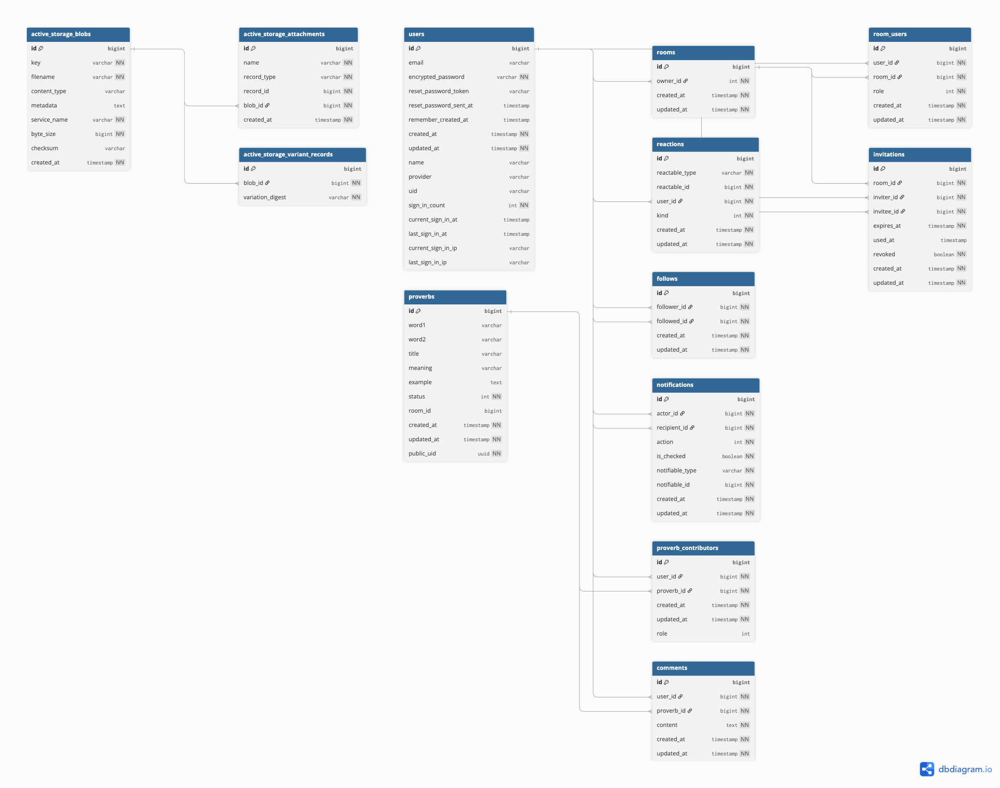

# ないないことわざ
サービスURL : https://nainai-kotowaza.com

 
 # サービス概要
 「ないないことわざ」はこの世に存在しないオリジナルのことわざを誰かと一緒に作ったり、1人で作ることができるサービスになります。 
 一緒にことわざを作ることで人との距離を近づけるサービスとなっております。 
 自分のアイデアをAIに渡すことで、オリジナルのことわざをサクッと作ることもできます。

 # サービス開発の背景
RUNTEQを通して、様々な人に出会いました。彼らとより仲良くなりたいと思い、オンライン上で人と仲良くなれるサービスの開発を始めました。 
人との親密度を上げるには、2つの要素があると思いました。

 - 共同作業
 - 笑い

私は言葉遊びが好きで、AIとオリジナルの言葉を作って遊んだりしていました。 
そこで、この2つの要素を達成でき、かつ自分らしさを取り入れたアプリを考えたときに「ことわざを一緒に作るアプリ」を思いつきました。 
ことわざは老若男女誰もが知っていて、幅の広がりもあるのでこのアプリに最適だと思い「ないないことわざ」の開発を始めました。 
人との親密度を上げるアプリが「ないないことわざ」になっております。

# 機能紹介

<h3 align="center">📨 招待機能（送信側）</h3>

  

  フォローしているユーザーの中から招待したい相手を選択して、 
  そのまま部屋を作成できます。 
  招待を送ると相手に通知が届き、承認されると共同制作が始まります。

---

 

<h3 align="center">📩 招待機能（受信側）</h3>

  

  メッセージから招待リンクを踏みます。 
  部屋に入ることで、一緒にことわざを作成することができます。

---

 

<h3 align="center">⌨️ リアルタイムで文字が反映される共同編集機能</h3>

  

  同じ部屋に入ることで、チャンネルのストリームを購読します。 
  WebSocketの双方向通信技術を使って、文字をリアルタイムで表示します。 
  空間だけでなく、時間も共有できるようになります。

---

 

<h3 align="center">🤖 AIと一緒にことわざを作成機能</h3>

  

  AIと一緒にことわざを作ることができます。 
  SSE接続を使うことで、文字をリアルタイムで表示します。 

 ## 技術スタック
 
 | カテゴリ       | 技術                             |
 |---------------|--------------------------------------|
 | フロントエンド | Rails 7.2.2.2 / Tailwind CSS / Hotwire |
 | バックエンド   | Rails 7.2.2.2（Ruby 3.2.3）          |
 | データベース   | PostgreSQL 17.5 （Neon）                        |
 | 開発環境      | Docker                              |
 | インフラ      | Render（App） / Neon（DB） / Amazon S3（Storage）                 |
 | 認証         | Devise / Google認証 / LINE認証                |
 | VCS          | GitHub                              |
 | CI/CD        | GitHub Actions                      |

## ER図

## 画面遷移図
[Figmaで見る](https://www.figma.com/design/Whvv7ajTtLstt9xWFO6quF/%E7%84%A1%E9%A1%8C?node-id=0-1&t=UN6kyosDwpZGuYSt-1)
